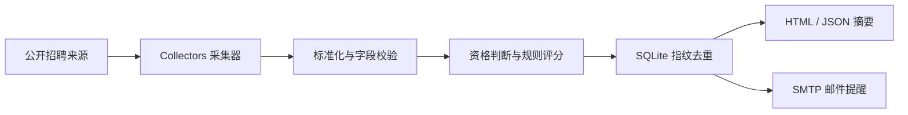
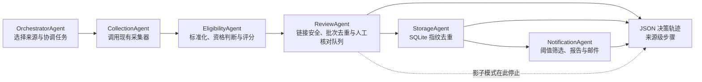

# 架构



## 设计原则

1. **硬规则优先**：毕业年份、城市和企业类型由确定性规则处理。
2. **解释性评分**：每个加减分都会记录原因。
3. **本地优先**：个人偏好、数据库和报告默认留在本地。
4. **采集器可替换**：站点变化时只更新对应适配器，不改评分和通知。
5. **失败可见**：来源异常进入运行结果，不能静默吞掉。
6. **有限重试**：TLS 断连、超时、连接错误及少数服务端错误只重试一次；
   证书错误和 401、403、404 等确定性错误立即报告。

`JobPosting.fingerprint` 优先使用“来源 + 外部岗位 ID”。来源没有 ID 时，使用公司、岗位、城市和 URL 的组合哈希。SQLite 同时保存 `first_seen_at` 与 `last_seen_at`，只有首次入库的岗位才进入提醒候选。

## 多 Agent 架构

正式监控和影子调试共用同一套专业 Agent。正式模式让一次采集结果继续进入存储和通知步骤，避免新旧流程重复访问招聘网站；影子模式在复核后停止，用于安全调试。



每个专业 Agent 都返回统一的 `AgentResult`，包含：

- `status`：成功、需复核、部分成功或失败；
- `evidence`：本次判断所依据的来源与统计；
- `warnings`：不能静默忽略的数据问题；
- `confidence`：该步骤可自动确认的结果占比，不是大模型概率；
- `next_action`：编排器或人工接下来应做什么；
- `metadata`：资格分布、去重数量和复核队列数量等机器可读信息。

这些 Agent 是确定性的专职执行单元，不依赖大模型，也不允许网页内容触发命令、代码执行或新增网络请求。招聘网页只被当作数据处理，所有访问仍由现有公开来源采集器发起。后续可以把来源发现、语义匹配和连接器草案生成接到相同接口之后。

正式模式：

```bash
python -m job_radar agent-monitor \
  --profile configs/profile.local.json \
  --sources configs/sources.json \
  --dry-run
```

`--dry-run` 只禁止发送邮件，仍会正常更新 SQLite 去重库并生成报告。移除该参数前应先确认 SMTP 配置和报告内容。

影子模式：

```bash
python -m job_radar agent-run \
  --include-demo \
  --source demo_official_jobs \
  --trace-file reports/agents/demo.json
```

影子模式不会读写 SQLite，也不会发送邮件；完整岗位只在轨迹文件顶层保存一次，各 Agent 步骤仅保存岗位数量，避免轨迹重复膨胀。旧的 `run` 命令保留为手动回退入口。
