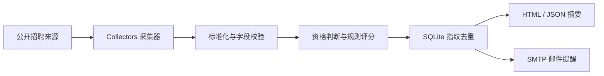

# 架构

## 设计原则

1. **硬规则优先**：毕业年份、城市和企业类型由确定性规则处理。
2. **解释性评分**：每个加减分都会记录原因。
3. **本地优先**：个人偏好、数据库和报告默认留在本地。
4. **采集器可替换**：站点变化时只更新对应适配器，不改评分和通知。
5. **失败可见**：来源异常进入运行结果，不能静默吞掉。

`JobPosting.fingerprint` 优先使用“来源 + 外部岗位 ID”。来源没有 ID 时，使用公司、岗位、城市和 URL 的组合哈希。SQLite 同时保存 `first_seen_at` 与 `last_seen_at`，只有首次入库的岗位才进入提醒候选。
